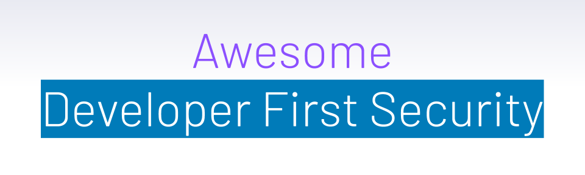
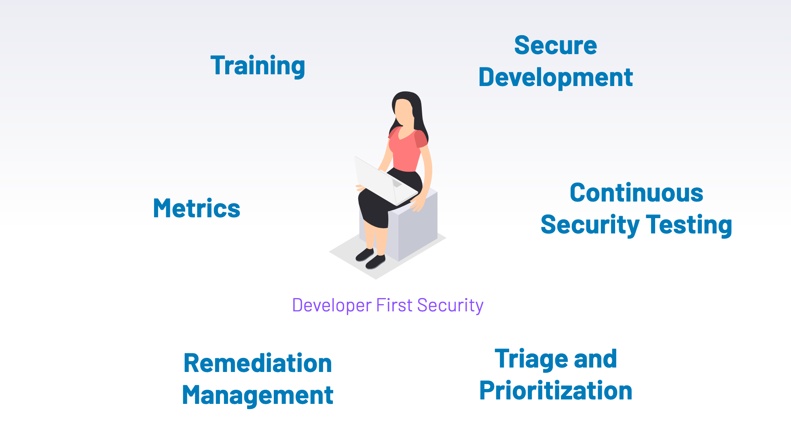

    

> A curated collection of tools and resources for building security with a developer first mindset.

Security with a dev-first mindset brings security closer to developers, empowering them to take ownership of security. This democratization of security changes the role of security teams to be an enabler rather than controller, and requires developers to embrace security as a first class citizen.

Your [contributions](https://github.com/h-parikh/awesome-dev-first-security/blob/main/contributing.md/) are always welcome !

# Contents
- [Secure Development](#secure-development)
- [Continuous Security Testing](#continuous-security-testing)
- [Triage and Prioritizaiton](#triage-and-prioritization)
- [Remediation Management](#remediation-management)
- [Metrics and Reporting](#metrics-and-reporting)
- [Training](#training)

## Secure Development
Resources and checklists that will help implement preventive measures to avoid security issues from being introduced during development.
- [OWASP ASVS](https://github.com/OWASP/ASVS/)
- [Mozilla’s Web Security Checklist](https://github.com/mozilla-services/websec-check/)
- [Test Driven Security in CI](https://www.youtube.com/watch?v=e2axToBYD68/)
- [API Security Checklist](https://github.com/shieldfy/API-Security-Checklist/)
- [Case studies of successfully eliminating entire classes of vulnerabilities](https://docs.google.com/presentation/d/1neDK74PT-y2zt-nOV0fN80m0TJeoBRp9iVZp8R78Jbg/edit#slide=id.g2baad2bc301217d9_10/)
- [Making safe coding patterns the default](https://www.slideshare.net/morganroman/banfootguns-devseccon-2019/)

## Continuous Security Testing
- Orchestrate scanners in CI/CD - [ReapSaw](https://github.com/dowjones/reapsaw/) and [Salus](https://github.com/coinbase/salus/)
- Orchestrate security using AWS step functions - [Slides](https://www.deepsec.net/docs/Slides/2018/Orchestrating_Security_Tooling_With_AWS_Step_Functions_Jules_Denardou_Justin_Massey.pdf/)
- GitHub app for security feedback in PRs - [GuardRails](https://github.com/apps/guardrails/)
- Static analysis for Infrastructure as Code - [Checkov](https://github.com/bridgecrewio/checkov/)
- Open source static analysis tool - [InsiderCLI](https://github.com/insidersec/insider/)
- [More Scanners](https://github.com/devsecops/awesome-devsecops#automation/)
- [Awesome BugBounty](https://github.com/djadmin/awesome-bug-bounty/)
- [Awesome Pen Testing](https://github.com/enaqx/awesome-pentest/)
- [Awesome Threat Modeling](https://github.com/redshiftzero/awesome-threat-modeling/)
- [Awesome Web Hacking](https://github.com/infoslack/awesome-web-hacking/)
- [Awesome Container Security](https://github.com/kai5263499/awesome-container-security/)
- [Building a Secure DevOps Pipeline](https://www.youtube.com/watch?v=IAzPKzwY-ks/)

## Triage and Prioritization
- Vulnerability intelligence service to prioritize CVEs - [vFeed](https://vfeed.io/) and [Vuldb](https://vuldb.com/) and [VulnDB](https://vulndb.cyberriskanalytics.com/)
- Research study for using ML in improving vulnerability identification - [Article](http://asankhaya.github.io/pdf/Effective-Identification-of-Vulnerabilities-using-Machine-Learning.pdf/)

This focuses on network vulnerabilities but several concepts can be borrowed in AppSec world 
- [Collective intelligence for contextual prioritization](https://delvesecurity.com/contextual-prioritization-score/)
- [Remediation Prioritization](https://delvesecurity.com/re-defining-vulnerability-remediation-prioritization/)
- [Threat Intelligence for Prioritization](https://delvesecurity.com/automating-threat-intel-with-machine-learning-extracting-the-underlying-concepts-from-underground-discussions-and-osint/)

## Remediation Management
- Building partnerships and enabling engineers - [Abstract](https://tldrsec.com/blog/appsec-cali-2019/#a-pragmatic-approach-for-internal-security-partnerships/) and [Original Video](https://www.youtube.com/watch?v=HIdexRqjpWc/)
- Art of Vulnerability Management - [Abstract](https://tldrsec.com/blog/appsec-cali-2019/#the-art-of-vulnerability-management/) and [Original Video](https://www.youtube.com/watch?v=EkyY1q2-JBI/)

## Metrics and Reporting
- Simple AppSec Metrics - [Abstract](https://tldrsec.com/blog/data-driven-bug-bounty/) and [Original video](https://www.youtube.com/watch?v=2TWY74MgTrc/)
- More Metrics - [Original Video](https://youtu.be/BxXV1pVSMn0?t=1751/)
- Vulnerability Aggregation Tool - [DefectDojo](https://github.com/DefectDojo/django-DefectDojo/)

## Training
- [Awesome AppSec](https://github.com/paragonie/awesome-appsec/)
- [Awesome Cyber Skills](https://github.com/joe-shenouda/awesome-cyber-skills/)
- [Security Champions Playbook](https://github.com/c0rdis/security-champions-playbook/)
- [Awesome CTF](https://github.com/apsdehal/awesome-ctf/)

